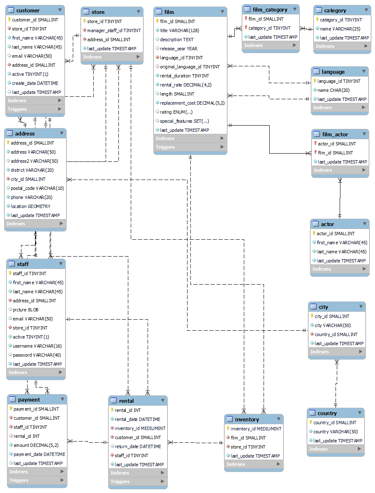

# Film-Rental-Case-Study-Using-SQL

This Project contains SQL queries, written to generate insightful reports for a film rental store database. The database schema encompasses various entities such as films, customers, staff, rentals, and payments. These queries aim to assist in generating key business insights for decision-making in day to day operations.

## Project Objectives

The main goal of this project is to write SQL queries to generate business insights and reports for the Film Rental Store. The reports help in decision-making and provide an in-depth understanding of the business operations.

## Schema Overview

The system database consists of the following main tables. Database Tables Overview

1. **Customer**: Stores information about customers, including their contact details and account status.  
2. **Store**: Represents stores, their locations, and the managers in charge.  
3. **Film**: Contains details about movies, such as title, description, and rental rates.  
4. **Film_Category**: Links films to their respective categories.  
5. **Category**: Defines the different genres or types of films (e.g., Action, Comedy).  
6. **Language**: Stores the languages available for films.  
7. **Film_Actor**: Maps actors to the films they have acted in.  
8. **Actor**: Contains details about film actors, including their names.  
9. **Address**: Stores physical addresses for customers, stores, and staff.  
10. **City**: Lists cities and links them to their respective countries.  
11. **Country**: Stores country names used to associate addresses.  
12. **Staff**: Contains information about store staff, including login credentials and assignments.  
13. **Rental**: Tracks film rentals, including rental and return dates.  
14. **Inventory**: Manages the inventory of films available at each store.  
15. **Payment**: Records payments made by customers for rentals.  

# SQL Queries

The report contains following insights:

## Insights List

1. **Total Revenue**:  
   Calculated the total revenue generated from all rentals.

2. **Rentals Per Month**:  
   Counted the number of rentals made in each month.

3. **Longest Title Rental Rate**:  
   Identified the rental rate of the film with the longest title.

4. **Average Rental Rate (Last 30 Days)**:  
   Computed, average rental rate for films rented in the last 30 days from a specific date.

5. **Most Popular Film Category**:  
   Computed, most popular film category based on the number of rentals.

6. **Longest Movie Not Rented**:  
   Finded the longest movie duration for films not rented by any customer.

7. **Average Rental Rate by Category**:  
   Calculated the average rental rate for films grouped by category.

8. **Revenue by Actor**:  
   Computed the total revenue generated from rentals for each actor.

9. **Actresses in Wrestling Films**:  
   Listed all the actresses who acted in films with "Wrestler" in the description.

10. **Repeat Rentals**:  
    Identified customers who rented the same film more than once.

11. **Comedy Films Above Average**:  
    Counted comedy films with a rental rate above the average rental rate.

12. **Most Rented Films by City**:  
    Identified the most rented films by customers living in each city.

13. **High Spending Customers**:  
    Calculated the total amount spent by customers with rental payments exceeding $200.

14. **Foreign Key Constraints**:  
    Displaying fields with foreign key constraints related to the rental table.

15. **Revenue by Staff View**:  
    Created a view showing revenue generated by each staff member, grouped by store city and country.

16. **Rental Info View**:  
    Created a view summarizing rental information, including customer names, rental days, and spending percentage.

17. **High Payments Within One Day**:  
    Displaying customers who paid 50% of their total rental costs within one day.
